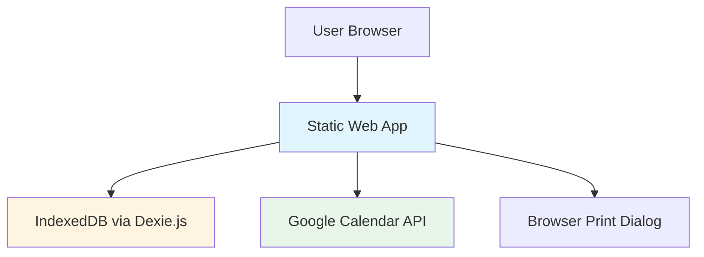
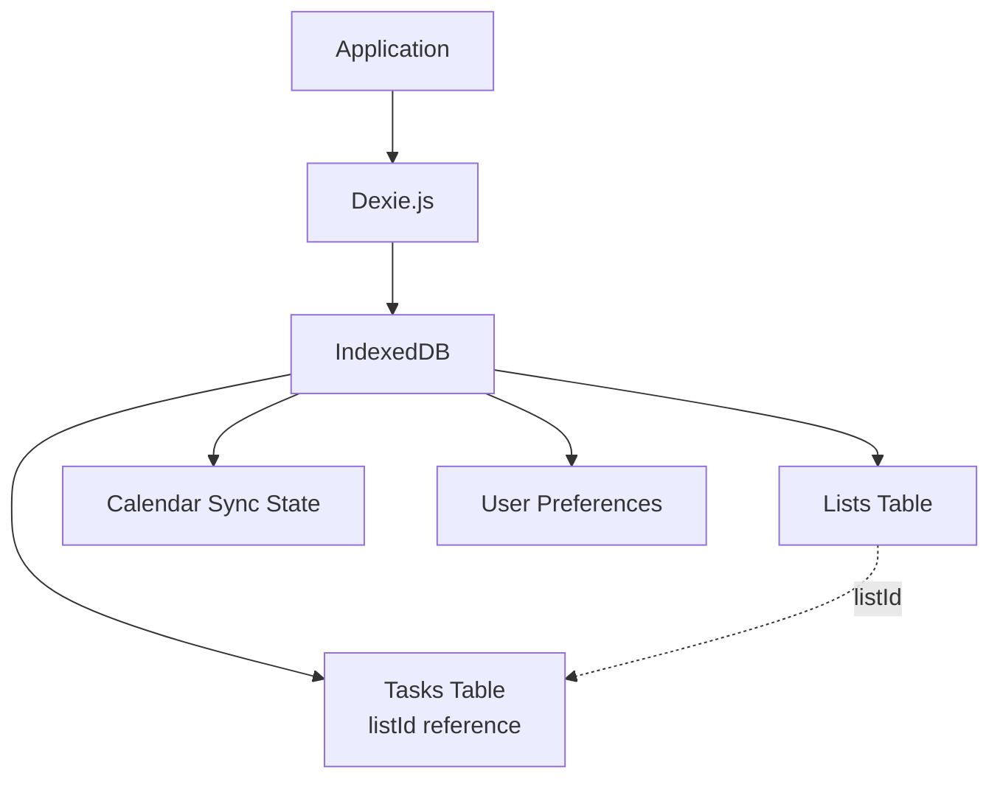
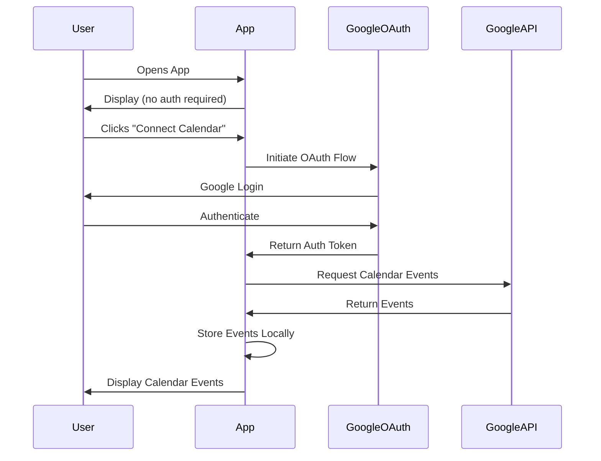
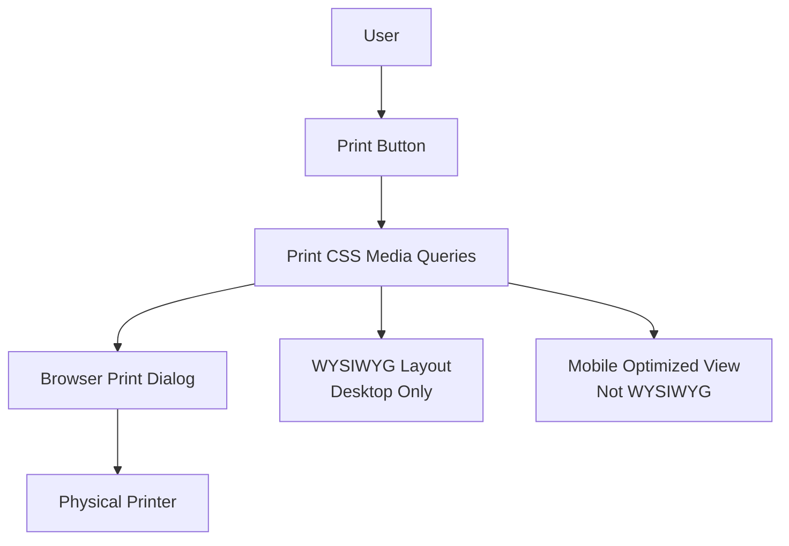
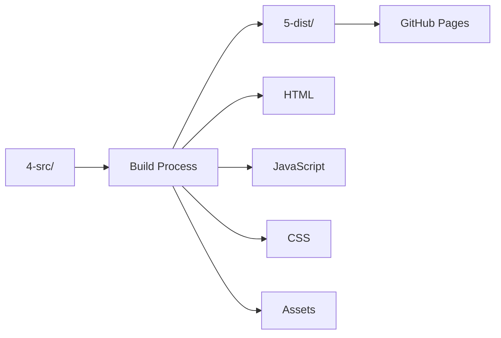

# Technical Architecture Document

## System Architecture Overview

The application is a fully client-side, static web application with no server-side dependencies. All data persistence is handled locally in the browser, and the application can be hosted as a static site on GitHub Pages.



## Technology Stack

### Frontend Framework
- **Svelte**: Primary framework chosen for performance and minimal bundle size
- **SvelteKit**: For routing and build tooling (if needed) or vanilla Svelte with Vite

### Styling
- **Tailwind CSS v3**: Utility-first CSS framework for styling (using v3.4.1 to match UI Kit compatibility)
- **Custom fonts/colors**: To be provided by design team

### UI/Interaction Libraries
- **Drag-and-Drop Library**: **svelte-dnd-action** (v0.9.68+)
- **Rationale**: 
  - **Svelte-native**: Built specifically for Svelte, works seamlessly with Svelte 5 (supports both `on:consider`/`on:finalize` and `onconsider`/`onfinalize` syntax)
  - **Nested containers**: Supports nested drop zones required for milestone 050 (cross-list dragging)
  - **Mobile/touch support**: Excellent touch device support, critical for mobile users
  - **Zero dependencies**: No external dependencies, keeping bundle size minimal
  - **Active maintenance**: Recently updated (maintained), actively developed
  - **Simple API**: Uses Svelte actions (`use:dndzone`), fits naturally with Svelte's component model
  - **Framework-agnostic alternatives considered**: SortableJS and native HTML5 were evaluated but rejected due to:
    - SortableJS: Requires more manual integration with Svelte reactivity
    - Native HTML5: Poor mobile/touch support, requires significant polyfills
  - **React-specific alternatives rejected**: @dnd-kit/core is React-specific and not suitable for Svelte projects

### Data Storage Library
- **Dexie.js**: IndexedDB wrapper library for simplified database operations
- **Rationale**: Provides simple Promise-based API, TypeScript support, and handles schema migrations

### Build Tools
- **Vite**: Build tool and dev server (if using SvelteKit or standalone Svelte)
- **Static output**: Must produce static files deployable to GitHub Pages

## Data Storage Architecture

### Storage Strategy
All data is stored locally in the browser using IndexedDB via Dexie.js. No cloud backend or server-side storage.



### Data Models

#### Current Model (Milestones 020-050)

**Lists**
- `id`: Unique identifier
- `name`: List name (can be `null` for unnamed lists)
- `order`: Display order
- `archivedAt`: Timestamp when list was archived (null if active) - *Added in milestone 040*

**Tasks**
- `id`: Unique identifier
- `text`: Task content
- `listId`: Reference to parent list (one-to-many)
- `order`: Display order within list
- `status`: Task state (`unchecked`, `checked`, `archived`) - *Added in milestone 030*

**Task State Transitions** (Milestone 030+)
- `unchecked` → `checked`: User marks task as complete
- `checked` → `archived`: User archives completed task
- `archived` → `checked`: User restores archived task (milestone 030+)
- Main page displays only `unchecked` and `checked` tasks
- Archived view displays only `archived` tasks
- **Note:** Task deletion moved to milestone 077

#### Future Model (Later Milestones)

**Tasks** (independent entities)
- `id`: Unique identifier
- `text`: Task content
- `time`: Optional start time
- `day`: Which day assigned to (null if not assigned)
- `source`: User-created or Google Calendar
- `weekId`: Week identifier

**Backlog Lists**
- `id`: Unique identifier
- `name`: List name
- `order`: Display order

**Backlog Items** (junction table)
- `id`: Unique identifier
- `listId`: Reference to backlog list
- `taskId`: Reference to task
- `order`: Display order within list

**Relationships**
- Tasks can exist in multiple lists (via junction table)
- Tasks can exist in a day without being in any list
- Tasks can exist in both lists and days

**Days**
- Not separate entities - query tasks where `day` is not null
- Day values: day names (e.g., "Monday") or dates (e.g., "2024-01-15")

#### User Preferences
- Settings
- Profile information
- Display preferences

### Storage Implementation
- **Storage Method**: IndexedDB via Dexie.js for all data (tasks, backlog, preferences, calendar state)
- **Data Format**: Structured objects stored directly (no JSON serialization needed)

### Dexie.js Database Schema

#### Schema Version 1 (Milestone 020): Simple One-to-Many
```javascript
import Dexie from 'dexie';

const db = new Dexie('TaskPlannerDB');
db.version(1).stores({
  lists: '++id, name, order',
  tasks: '++id, text, listId, order',
  preferences: 'key',
  calendarSyncState: 'key'
});
```

- **Lists Table**: Backlog list definitions
- **Tasks Table**: Tasks with direct `listId` reference (one task belongs to one list)
- **Query Pattern**: `db.tasks.where('listId').equals(listId).toArray()`

#### Schema Version 2 (Milestone 030+): Add Task Status
```javascript
db.version(2).stores({
  lists: '++id, name, order',
  tasks: '++id, text, listId, order, status',
  preferences: 'key',
  calendarSyncState: 'key'
}).upgrade(tx => {
  // Migration: Set all existing tasks to 'unchecked' status
  return tx.tasks.toCollection().modify(task => {
    task.status = 'unchecked';
  });
});
```

- **Tasks Table**: Adds `status` field (`unchecked`, `checked`, `archived`)
- **Query Pattern (Main View)**: `db.tasks.where('listId').equals(listId).and(task => task.status !== 'archived').toArray()`
- **Query Pattern (Archived View)**: `db.tasks.where('status').equals('archived').toArray()`

#### Schema Version 3 (Milestone 040+): Add List Archiving
```javascript
db.version(3).stores({
  lists: '++id, name, order, archivedAt',
  tasks: '++id, text, listId, order, status, archivedAt',
  preferences: 'key',
  calendarSyncState: 'key'
}).upgrade(tx => {
  // Migration: Add archivedAt field to lists and tasks (defaults to null/undefined)
  // No data migration needed - existing records will have undefined archivedAt
  return Promise.resolve();
});
```

- **Lists Table**: Adds `archivedAt` field (timestamp when archived, null/undefined if active)
- **Tasks Table**: Adds `archivedAt` field (timestamp when archived, null/undefined if active)
- **Query Pattern (Main View Lists)**: `db.lists.where('archivedAt').equals(null).or('archivedAt').equals(undefined).toArray()`
- **Query Pattern (Archived View Lists)**: `db.lists.where('archivedAt').above(0).toArray()` or filter by `archivedAt != null`
- **Note:** Tasks use `status` field for archiving, `archivedAt` is for timestamp tracking

#### Future Schema (Later Milestones): Many-to-Many with Junction Table
```javascript
db.version(4).stores({
  tasks: '++id, day, time, weekId, text, source, status',
  backlogLists: '++id, name, order',
  backlogItems: '++id, listId, taskId, order',
  preferences: 'key',
  calendarSyncState: 'key'
});
```

- **Tasks Table**: Independent entities (can exist in multiple lists or days), retains `status` field
- **BacklogLists Table**: Backlog list definitions
- **BacklogItems Table**: Junction table for many-to-many (tasks ↔ lists)
- **Query Pattern**: Join `backlogItems` (filtered by `listId`) with `tasks` (filtered by `taskId` and `status`)

#### Migration Strategy
- **Version 1 → Version 2** (Milestone 030): Add `status` field, default existing tasks to `unchecked`
- **Version 2 → Version 3** (Milestone 040): Add `archivedAt` field to lists and tasks for archiving support
- **Version 3 → Version 4** (Later): Migrate to many-to-many when tasks need to exist in multiple lists
- Use Dexie migrations to convert `tasks.listId` → `backlogItems` entries
- Abstract list access patterns in code to ease migration
- Preserve `status` field through all migrations

## Google Calendar Integration

### Authentication Flow
Optional authentication using Google OAuth 2.0. Users can use the app without logging in.



### API Integration
- **API**: Google Calendar API v3
- **Authentication**: OAuth 2.0
- **Scope**: Read-only calendar access
- **Sync Trigger**: On page load/refresh (when authenticated)
- **Token Storage**: Browser handles OAuth token persistence
- **Data Flow**: User authenticates (optional) → App requests calendar events → Events stored locally → Events displayed as tasks (read-only)

## Print Functionality

### Print Architecture
The application uses CSS print media queries to format the layout for printing.



### Implementation Details
- **Print Trigger**: Browser's `window.print()` API
- **Layout**: CSS `@media print` queries
- **Page Size**: 8.5x11" (US) or A4 (international)
- **Print Resolution**: Printers print at 96 DPI (device independent pixels per inch)
- **8.5x11" Dimensions**: 816 × 1056 DIP/px (8.5 × 96 = 816, 11 × 96 = 1056)
- **Layout Constraints**: Print layout should be designed within these pixel dimensions for accurate WYSIWYG rendering
- **WYSIWYG**: Desktop view matches print output
- **Mobile**: Optimized for screen, not necessarily WYSIWYG

## Mobile Architecture

### Responsive Design
- **Framework**: Tailwind CSS responsive utilities
- **Breakpoints**: Standard Tailwind breakpoints (sm, md, lg, xl)
- **Layout**: Same print-focused layout, optimized for mobile viewing

### Mobile-Specific Considerations
- Touch interactions for drag-and-drop
- Mobile-optimized UI (not strictly WYSIWYG)
- Full feature parity with desktop
- Ability to add and edit lists on mobile

## Build & Deployment

### Build Process


### Deployment
- **Hosting**: GitHub Pages (static site)
- **Build Output**: Static HTML, CSS, JavaScript files
- **No Server Required**: Fully static deployment
- **CDN**: GitHub Pages provides CDN for static assets

### Development Workflow
1. Develop in `4-src/` folder
2. Build process compiles to `5-dist/` folder
3. Deploy `5-dist/` contents to GitHub Pages
4. Changes should not be made directly in `5-dist/`

### Design Kit / Component Library
- **Purpose**: Development-only HTML page showcasing design system and components
- **Location**: Live-coded HTML page in development environment (not included in production build)
- **Contents**: 
  - Design tokens (colors, fonts, spacing)
  - Component examples (buttons, inputs, task items, etc.)
  - Layout patterns
  - Print layout preview
- **Usage**: Reference for developers during implementation, ensures design consistency
- **Exclusion**: Not deployed to production (excluded from build output)

## Performance Considerations

### Optimization Strategies
- **Svelte**: Chosen for minimal bundle size and fast runtime
- **Code Splitting**: Lazy load Google Calendar integration (only when authenticated)
- **Dexie.js/IndexedDB**: Use indexes for efficient queries, load only current week's tasks by default
- **Print CSS**: Optimized print stylesheets to reduce print dialog delay

### Performance Targets
- Fast initial load time
- Smooth drag-and-drop interactions
- Quick print dialog rendering
- Efficient local storage operations

## Browser Compatibility

### Supported Browsers
- Modern browsers only (Chrome, Firefox, Safari, Edge - latest versions)
- No support for Internet Explorer or legacy browsers
- Mobile browsers: iOS Safari, Chrome Mobile, Firefox Mobile

### Required Browser Features
- ES6+ JavaScript support
- IndexedDB API
- CSS Grid/Flexbox
- OAuth 2.0 support
- Print API

## Testing Strategy

### Testing Framework
- **Vitest**: Test runner (Vite-native, fast, ESM support, Jest-compatible API)
- **@testing-library/svelte**: Component testing utilities for Svelte (rendering, queries)
- **jsdom**: DOM simulation for browser environment testing (configured in vite.config.js)
- **@testing-library/jest-dom**: DOM matchers for readable assertions (`toBeInTheDocument()`, `toHaveClass()`, etc.)
- **@testing-library/user-event**: User interaction simulation for integration tests (more realistic than `fireEvent`)
- **Playwright**: End-to-end browser testing for PDF validation (generates actual PDFs to verify single-page constraint)

### Test Categories

#### Unit Tests
- Component rendering and behavior
- Utility functions and helpers
- Data model operations (Dexie.js queries)

#### Integration Tests
- Component interactions
- Data persistence (IndexedDB operations)
- Google Calendar API integration (mocked)

#### End-to-End PDF Tests (Playwright)
- **PDF output validation**: Generate actual PDFs and verify single-page constraint
  - Generate PDF from print layout using Playwright's `page.pdf()`
  - Verify PDF contains exactly 1 page (no overflow to page 2)
  - Test with realistic data (full task lists, maximum content)
  - Validate dimensions match expected 816 × 1056 px layout
  - *Validates actual PDF output - if PDF is 1 page, CSS is working correctly*

### Test Structure & Commands
```
4-src/
  src/
    __tests__/
      components/
      utils/
      print/
        print-layout.test.js        # CSS validation (Vitest)
        print-pdf.e2e.test.js      # PDF output validation (Playwright)
```

**Commands:**
- `npm test`: Run all Vitest tests (unit + integration)
- `npm run test:watch`: Watch mode for Vitest
- `npm run test:coverage`: Coverage report
- `npm run test:e2e`: Run Playwright PDF validation tests (slower, run separately)

### Test Requirements
- All new features must include tests
- Print layout changes must include both CSS validation tests and PDF output validation
- Minimum 80% code coverage target (Vitest tests)
- All tests (including PDF validation) run in CI/CD pipeline before deployment

## Security Considerations

### OAuth Security
- OAuth tokens stored in browser (handled by Google's OAuth flow)
- No server-side token storage required
- HTTPS required for OAuth (GitHub Pages provides HTTPS)

### Local Data Security
- All data stored locally in user's browser
- No data transmitted to external servers (except Google Calendar API)
- User has full control over their local data

## Future Architecture Considerations

### Cloud Storage (Next Iteration)
- Potential migration path for cloud sync
- Maintain backward compatibility with local storage
- Hybrid approach: local-first with cloud backup

### Handwriting Capture (Next Iteration)
- Photo upload functionality
- Image processing for handwriting recognition
- Integration with existing task system

