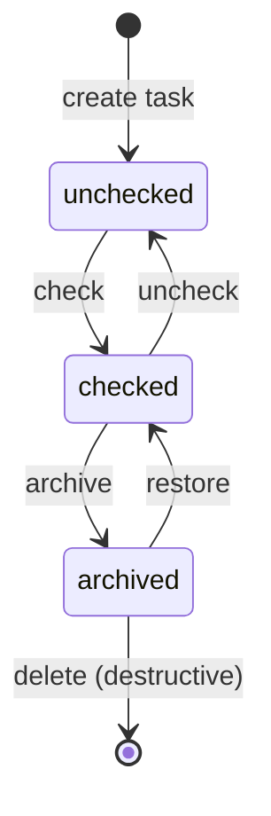

# 030: Task CRUD & State Management

## Goal
Enable users to create, delete, and manage task states within lists. Implement task state management (unchecked → checked → archived). Handle empty task state behavior (what happens when a list has no tasks). **No formatting focus** - focus purely on functionality.

## Task State Diagram

**Display Rules:**
- Main page shows only **unchecked** and **checked** tasks
- **Archived** tasks are hidden from main page
- Archived view (temporarily below printed page area) shows all **archived** tasks
- Only archived tasks can be destructively deleted

## Acceptance Criteria
- [ ] Users can create new tasks in a list (defaults to `unchecked` state)
- [ ] Users can check/uncheck tasks (toggle between `unchecked` and `checked` states)
- [ ] Users can archive checked tasks (move from `checked` to `archived` state)
- [ ] Archived tasks are hidden from main page display
- [ ] Archived view displays all archived tasks (temporarily below printed page area)
- [ ] Users can restore archived tasks (move from `archived` back to `checked` state)
- [ ] Users can destructively delete tasks from archived view (requires confirmation modal)
- [ ] Empty task state is handled appropriately (display when list has no unchecked/checked tasks)
- [ ] Task state and order persist in IndexedDB
- [ ] Task state and order persist across page refreshes
- [ ] No formatting/styling focus - just functional implementation

## Implementation Steps

1. **Update Database Schema** ✅
   - Add `status` field to tasks table (values: `unchecked`, `checked`, `archived`) ✅
   - Update database version (migration from version 1 to version 2) ✅
   - Update existing mock data to include `status: 'unchecked'` for all tasks ✅
   - Update data access functions to handle status field ✅

2. **Task Creation** ✅
   - Add UI for creating new tasks (input field + button or form) ✅
   - Implement function to add task to IndexedDB ✅
   - Assign task to current list (`listId`) ✅
   - Set `status: 'unchecked'` by default ✅
   - Set appropriate `order` value (append to end or handle insertion) ✅
   - Update UI reactively after creation ✅

3. **Task State Management** ✅
   - Add checkbox/button to toggle task between `unchecked` and `checked` states ✅
   - Implement function to update task status in IndexedDB ✅
   - Display checked tasks with strikethrough styling ✅
   - Add archive button/action for checked tasks ✅
   - Implement function to change task status from `checked` to `archived` ✅
   - Update UI reactively after state changes ✅ (using liveQuery)

4. **Task Filtering & Display** ✅
   - Filter tasks in main view: only show `unchecked` and `checked` tasks ✅
   - Hide `archived` tasks from main page display ✅
   - Update data access functions to filter by status ✅

5. **Archived View**
   - Create archived view component/section (temporarily below printed page area)
   - Display all tasks with `status: 'archived'`
   - Add restore button for each archived task
   - Implement restore function (change status from `archived` to `checked`)
     - **Restore behavior**: Append restored task to end of list (max order + 1) - see [[040-list-crud-ordering#Restore Behavior]] for handling edge case when list no longer exists
   - Add delete button for each archived task
   - Implement confirmation modal for destructive delete
   - Implement destructive delete function (permanently remove from IndexedDB) - only after confirmation
   - Update UI reactively after restore or deletion

6. **Empty Task State**
   - Detect when a list has no unchecked/checked tasks (archived tasks don't count)
   - Display appropriate empty state message/UI
   - Ensure empty state doesn't break functionality
   - Handle edge case: creating first task in empty list

7. **Data Persistence**
   - Verify all CRUD operations and state changes persist to IndexedDB
   - Test that status and order persist across page refreshes
   - Ensure no data loss on refresh
   - Verify archived tasks remain archived after refresh

8. **Test**
   - **Manual Testing**:
     - Create tasks, verify they appear (unchecked) and persist
     - Check/uncheck tasks, verify state changes and persist
     - Archive checked tasks, verify they disappear from main view
     - Verify archived tasks appear in archived view
     - Restore archived tasks, verify they return to checked state and appear in main view
     - Delete archived tasks: verify confirmation modal appears, verify permanent removal after confirmation
     - Test canceling delete action (close modal without deleting)
     - Test empty state behavior (when no unchecked/checked tasks)
     - Refresh page, verify all state changes persist
     - Verify archived tasks remain archived after refresh
   - **Automated Tests**:
     - Unit tests: CRUD operations on database with status field
     - Unit tests: State transitions (unchecked → checked → archived → checked)
     - Unit tests: Task filtering by status
     - Integration tests: UI interactions create/check/archive/restore/delete tasks
     - Integration tests: Archived view displays archived tasks
     - Integration tests: Restore functionality returns task to checked state
     - Test empty state display

## Quick Notes
- Database schema: Update from [[020-mock-data-display]] - add `status` field to tasks table
- Database migration: Version 1 → Version 2 (add status field, default existing tasks to `unchecked`)
- Task `status` field: Values are `unchecked`, `checked`, `archived`
- Task `order` field: Maintained from mock data, will be used for reordering in milestone 031
- Main page filtering: Only display tasks where `status IN ('unchecked', 'checked')`
- Archived view: Display all tasks where `status = 'archived'` (temporarily below printed page area)
- Restore functionality: Change archived task status from `archived` back to `checked` (returns to main view)
- Destructive delete: Only available for archived tasks, requires confirmation modal before permanently removing from database
- Empty state: Simple message/placeholder, no formatting focus (based on unchecked/checked tasks only)
- Requires: [[020-mock-data-display]]
- Task reordering: Moved to milestone [[031-task-reordering]]
- No formatting concerns - basic HTML/UI is fine

