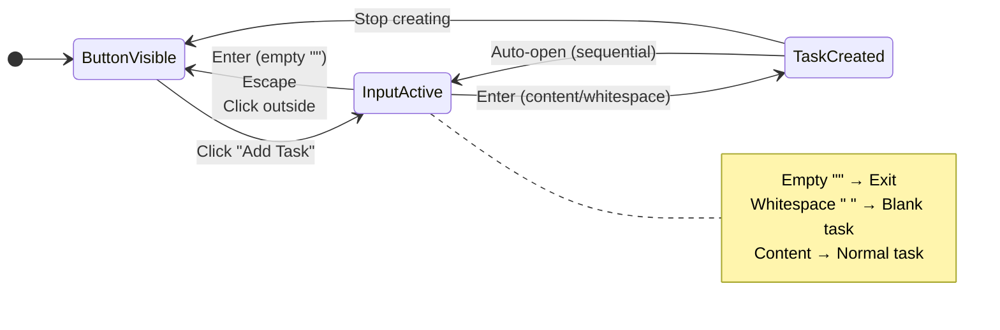
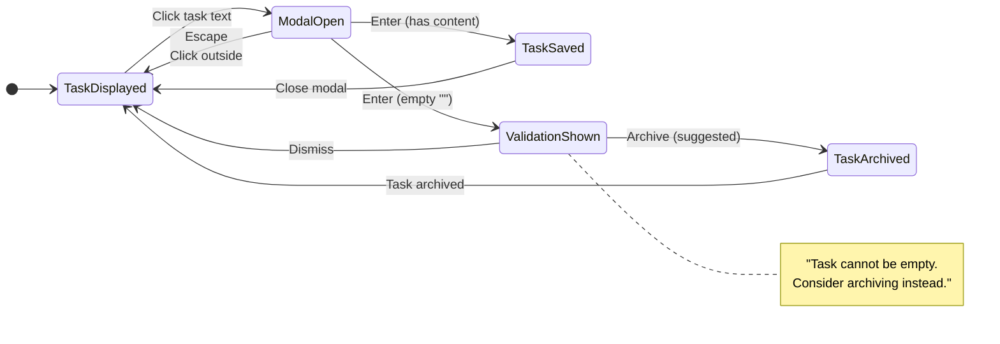

# 032: Task UX Behaviors

## Goal
Refine task interaction patterns and keyboard behaviors. Define and implement UX behaviors for task creation, editing, focus management, and keyboard navigation. **No formatting focus** - focus purely on interaction behavior.

## User Stories

| As a user... | I need... | So that... | Details |
|--------------|-----------|------------|---------|
| **Task Editor** | A way to edit tasks | I can correct mistakes and update task descriptions | • Clicking on a task opens a modal overlay (similar to Trello) that shades out the background • The modal appears immediately overlaid on the underlying task card • Pressing Enter saves the edit (if input has content) • Clicking a Save button saves the edit (if input has content) • If input is empty (empty string ""), Enter/Save is prevented and validation suggests archiving instead • Clicking outside the modal or pressing Escape discards the edit without saving |
| **Rapid Task Creator** | A way to quickly create tasks in sequence | I can rapidly capture multiple tasks without interruption | • A button is shown instead of an always-visible input field (reduces clutter) • Clicking the "Add Task" button opens an input field with cursor focus • Pressing Enter saves the task and automatically opens another input field with focus (enables rapid sequential creation) • Pressing Enter on empty string "" exits task creation (closes input, shows button) • Pressing Escape or clicking outside without saving closes the input and shows the button again • The button is hidden during printing but retains its space (maintains consistent page spacing) |
| **Blank Task Creator** | A way to create blank tasks | I can add placeholders and fill them in later | • Tasks containing only whitespace (spaces, tabs, etc.) should be treated as blank tasks and allowed • Examples: single space " ", multiple spaces "      " create blank tasks • Empty string "" does NOT create a task, but exits task creation mode |

## State Diagram

### Task Creation Flow

### Task Editing Flow

## Acceptance Criteria
- [ ] Clicking on a task opens a modal overlay that shades out the background
- [ ] Modal appears immediately overlaid on the underlying task card
- [ ] Enter key saves the edit and closes the modal (if input has content)
- [ ] Save button saves the edit and closes the modal (if input has content)
- [ ] Empty input in edit modal prevents saving and shows validation suggesting archiving instead
- [ ] Clicking outside the modal or pressing Escape discards changes and closes the modal
- [ ] "Add Task" button replaces always-visible input field (reduces clutter)
- [ ] Clicking "Add Task" button opens input field with cursor focus
- [ ] Enter key in task input creates new task (allows blank tasks with whitespace) and automatically opens another input field with focus for sequential creation
- [ ] Enter key on empty string "" exits task creation (closes input, shows button)
- [ ] Escape or click-outside closes input and shows button again
- [ ] "Add Task" button is hidden during printing but retains space (maintains page spacing)
- [ ] Focus management works correctly after all actions (create, edit, archive, delete)
- [ ] Keyboard navigation works (Tab order is logical, Enter/Escape behave correctly)
- [ ] Blank tasks can be created (whitespace-only input allowed - e.g., " ", "      ")
- [ ] Empty string "" does NOT create a task, but exits task creation mode
- [ ] Input fields for task creation and editing have width constraints matching task width (150px)
- [ ] Input fields support word wrapping for long text (may require textarea instead of input)
- [ ] No formatting/styling focus - just functional interaction behavior

## Implementation Steps

1. **Define UX Behaviors** ✅
   - Document desired behaviors:
     - "Add Task" button replaces always-visible input (reduces clutter)
     - Clicking "Add Task" button opens input field with focus
     - Enter in task input creates task (allows blank tasks with whitespace - " ", "      ")
     - Enter on empty string "" exits task creation (closes input, shows button)
     - Escape in task input closes input and shows button
     - Click outside task input (without saving) closes input and shows button
     - Clicking task text opens modal overlay (Trello-style)
     - Enter in edit modal saves and closes (if input has content)
     - Empty input in edit modal prevents saving and shows validation suggesting archiving
     - Escape in edit modal discards and closes
     - Click outside edit modal discards and closes
     - Where does focus go after creating a task? (new input field for sequential creation)
     - Where does focus go after closing edit modal?
     - Tab navigation between tasks
     - Print behavior: button hidden but retains space
   - Document edge cases and error states

2. **Implement Add Task Button & Input Toggle** ✅
   - Replace always-visible input with "Add Task" button
   - Button click opens input field and focuses cursor
   - Input field replaces button when active
   - Hide button during printing but retain space (use CSS visibility or similar to maintain layout)
   - Implement Escape key handler to close input and show button
   - Implement click-outside handler to close input and show button (only if no changes made)

3. **Implement Enter Key Behavior for Task Creation** ✅
   - Check if input is empty string "" - if so, exit task creation (close input, show button)
   - If input contains only whitespace (e.g., " ", "      "), create blank task
   - If input has content (non-empty, non-whitespace-only), create task with that content
   - After saving task, automatically open new input field with focus (enables sequential creation)

4. **Implement Focus Management** ✅
   - Focus new task input after creation (enables sequential task creation)
   - Focus input field when edit modal opens
   - Return focus to task or next logical element when edit modal closes
   - Handle focus when archiving/restoring tasks
   - Handle focus when deleting tasks
   - Maintain focus order for keyboard navigation

5. **Implement Modal-Based Task Editing** ✅
   - Create modal component for task editing
   - Implement click handler on task text to open modal
   - Modal overlays task card and shades background
   - Modal contains task text input field
   - Implement validation: check if input is empty string ""
   - If input is empty, prevent saving (Enter/Save button disabled or shows validation)
   - Show validation message suggesting archiving instead (e.g., "Task cannot be empty. Consider archiving this task instead.")
   - If input contains only whitespace (e.g., " ", "      "), allow saving as blank task
   - If input has content (non-empty, non-whitespace-only), allow saving normally
   - Implement Enter key handler to save and close modal (only if input has content or whitespace)
   - Implement Save button to save and close modal (only if input has content or whitespace)
   - Implement Escape key handler to discard changes and close modal
   - Implement click-outside handler to discard changes and close modal
   - Focus management: focus input field when modal opens
   - Focus management: return focus appropriately when modal closes

6. **Implement Keyboard Navigation** ✅
   - ✅ Tab navigation: ensure logical tab order through tasks and interactive elements
     - Drag handles excluded from tab order (tabindex="-1", aria-hidden="true")
     - Tab order: checkbox → task text → archive button (if checked) → Add Task button
   - ✅ Enter: create task (in input), open edit modal (on task text), or save edit (in modal, if valid)
     - Enter on task text span opens edit modal (capture-phase handler prevents drag library from intercepting)
   - ✅ Escape: cancel task creation or discard edit
   - ✅ Ensure all interactive elements are keyboard accessible
     - Added aria-labels to all buttons and interactive elements
     - Added aria-label to checkboxes with task context
     - Added aria-label to task text spans for editing
     - Added aria-label to modal buttons
     - Added aria-describedby to modal input for validation messages
     - Added role="alert" to validation messages
   - (Arrow keys and other shortcuts deferred - focus on core Tab/Enter/Escape first)

7. **Handle Edge Cases**
   - ✅ Empty string "" handling in task creation (exit task creation, don't create task) - Implemented in TaskList.svelte handleCreateTask()
   - ✅ Whitespace-only input handling in task creation (treat as blank task, create blank task) - Implemented in TaskList.svelte handleCreateTask()
   - ✅ Empty string "" handling in edit modal (prevent saving, show validation suggesting archiving) - Implemented in TaskEditModal.svelte handleSave()
   - ✅ Whitespace-only input handling in edit modal (allow saving as blank task - consistent with creation) - Implemented in TaskEditModal.svelte handleSave()
   - ✅ Distinguish between empty string and whitespace-only (empty exits in creation, empty prevents save in edit) - Both components correctly distinguish these cases
   - ✅ Validation message in edit modal when input is empty (suggest archiving) - Implemented with role="alert" and aria-describedby
   - ✅ Canceling edit (revert to original task text) - Implemented in TaskEditModal.svelte handleCancel()
   - ✅ Focus when list is empty - "Add Task" button is focusable and accessible when list is empty
   - ✅ Focus when all tasks are archived - Archive handler focuses "Add Task" button as fallback (TaskList.svelte lines 212-215)
   - ✅ Keyboard navigation with no tasks - "Add Task" button is keyboard accessible (tabindex="0" by default for buttons)
   - ✅ Modal behavior when task is deleted while modal is open - N/A: Tasks can only be deleted from archived view, not while modal is open
   - ✅ Modal behavior when task is archived while modal is open - Modal closes and focus moves to next task or "Add Task" button (TaskList.svelte lines 177-218)

8. **Limit Task Width and Enable Word Wrapping** ✅
   - ✅ Add max-width constraint to task text elements - Set fixed width of `150px` using `w-[150px]` class
   - ✅ Enable word wrapping for long task text - Added `break-words` Tailwind class to enable word wrapping
   - ✅ Ensure tasks wrap nicely instead of extending horizontally - Fixed width with word wrapping ensures text wraps within 150px

9. **Add Width and Word Wrapping to Input Fields** ✅
   - ✅ Add width constraint to task creation input field (match task width of 150px) - Converted to textarea with `w-[150px] flex-none` classes
   - ✅ Add width constraint to edit modal input field (match task width) - Converted to textarea with `w-[150px] flex-none` classes
   - ✅ Enable word wrapping in input fields (may require converting `<input>` to `<textarea>`) - Both inputs converted to `<textarea>` with `break-words` class
   - ✅ Ensure input fields wrap text nicely instead of extending horizontally - Textareas wrap text within 150px width
   - ✅ Maintain all existing keyboard behaviors (Enter to save, Escape to cancel, etc.) - Enter (without Shift) saves, Shift+Enter adds newline, Escape cancels
   - ✅ Ensure textarea auto-resizes or has appropriate height for multi-line text - Auto-resizes with min-height 2.5rem and max-height 10rem (160px)

10. **Test** ✅
   - **Manual Testing**: ✅
     - ✅ Test Enter key behavior in various scenarios
     - ✅ Test focus management after all actions
     - ✅ Test click behaviors on tasks
     - ✅ Test keyboard navigation
     - ✅ Test edge cases (empty input, canceling edit, etc.)
   - **Automated Tests**: ✅
     - ✅ Integration tests: "Add Task" button opens input field with focus
     - ✅ Integration tests: Enter key on empty string "" exits task creation (closes input, shows button)
     - ✅ Integration tests: Enter key creates task (including blank tasks with whitespace - " ", "      ") and automatically opens new input for sequential creation
     - ✅ Integration tests: Escape key closes input and shows button
     - ✅ Integration tests: Click-outside closes input and shows button
     - ✅ Integration tests: Button hidden during print but retains space
     - ✅ Integration tests: Clicking task opens edit modal
     - ✅ Integration tests: Enter in edit modal saves and closes (when input has content or whitespace)
     - ✅ Integration tests: Enter in edit modal with empty input prevents saving and shows validation
     - ✅ Integration tests: Enter in edit modal with whitespace-only saves as blank task
     - ✅ Integration tests: Save button in edit modal with empty input prevents saving and shows validation
     - ✅ Integration tests: Save button in edit modal with whitespace-only saves as blank task
     - ✅ Integration tests: Validation message suggests archiving when input is empty
     - ✅ Integration tests: Escape in edit modal discards and closes
     - ✅ Integration tests: Click outside edit modal discards and closes
     - ✅ Integration tests: Save button saves and closes modal (when input has content)
     - ✅ Integration tests: Keyboard navigation works
     - ✅ Integration tests: Focus management after CRUD operations

## Quick Notes
- Focus on interaction behavior, not visual styling
- Ensure keyboard accessibility
- Consider mobile/touch interactions (may defer to later milestone)
- Requires: [[030-task-crud-ordering]] (and optionally [[031-task-reordering]])
- No formatting concerns - basic HTML/UI is fine

