# 040: List CRUD & Ordering

## Goal
Enable users to create, rename, sort, archive, and restore lists. Handle empty list state behavior (what happens when no lists exist). Handle restoring archived tasks whose lists are archived. **No formatting focus** - focus purely on functionality.

## User Stories

| As a user... | I need... | So that... |
|--------------|-----------|------------|
| **List Creator** | Empty state way to create a new list | I can get started when I have no lists |
| **List Creator** | Non-empty state way to create a new list | I can add more lists when I already have lists |
| **List Editor** | A way to rename existing lists | I can update list names as my needs change |
| **List Organizer** | A way to sort existing lists | I can prioritize and organize my lists |
| **List Archiver** | A way to archive existing lists | I can hide lists I no longer need (lots of questions on this one) |
| **List Restorer** | A way to restore archived lists | I can bring back lists I previously archived |
| **Task Restorer** | Graceful handling when restoring tasks to archived lists | I don't encounter errors when restoring archived tasks whose lists are archived |

## List State Diagram

### Empty State & List Creation Flow

```mermaid
stateDiagram-v2
    [*] --> EmptyState: no lists exist
    
    EmptyState --> NamingList: click "name a list" button
    EmptyState --> ListsExist: click "add a task" button
    
    NamingList --> ListsExist: enter name (non-empty)
    NamingList --> EmptyState: cancel/escape (if from empty state)
    NamingList --> ListsExist: cancel/escape (if from lists exist)
    
    ListsExist --> NamingList: click "name a list" or "name a new list"
    ListsExist --> ListsExist: add task(s) to current/new list
    
    note right of EmptyState
        Buttons visible:
        - "Name a list"
        - "Add a task"
    end note
    
    note right of NamingList
        Transient state: naming input is active
        Can cancel to return to previous state
    end note
    
    note right of ListsExist
        Lists exist. Buttons: "Name a list", "Add a task", "Name a new list", "Add a new task". Rules: Named lists cannot be unnamed; names cannot be empty.
    end note
```

## Build Sequence

Since we already have lists, we'll start with editing and adding new lists, then add archive (which will lead to the empty state), then restore.

1. Edit/rename existing lists
2. Clean up "Add Task" button
3. Add new lists (non-empty state)
4. Archive lists
5. Empty state (for creating lists when no lists exist)
6. Restore archived tasks (individual only) ✅
7. Sort/reorder lists

## Implementation Steps

1. **Edit/Rename Existing Lists** ✅
   - **Description:** Users can rename existing lists to update their names as needs change
   - **Acceptance Criteria:**
     - ✅ Users can rename lists
     - ✅ List names cannot be empty
     - ✅ Named lists cannot be unnamed
     - ✅ Rename persists in IndexedDB
     - ✅ UI updates reactively after rename
   - **Technical Work:**
     - ✅ Add UI for renaming lists using a modal similar to task editing (overlaid with blackout background)
     - ✅ Implement function to update list name in IndexedDB
     - ✅ Validate non-empty name
     - ✅ Update UI reactively after rename
     - ✅ Write tests: unit tests for rename function, integration tests for UI interaction

2. **Clean Up "Add Task" Button** ✅
   - **Description:** Refactor and clean up the "Add Task" button implementation to ensure consistent behavior and proper styling
   - **Acceptance Criteria:**
     - ✅ "Add Task" button is consistently styled across all list states
     - ✅ Button behavior is consistent (focus management, keyboard navigation)
     - ✅ Button is properly positioned within task lists
     - ✅ No visual jumping or layout shifts when button appears/disappears
   - **Technical Work:**
     - ✅ Review current "Add Task" button implementation
     - ✅ Ensure consistent styling (matches task item appearance)
     - ✅ Position button outside `<ul>` but aligned with task items using wrapper div and CSS
     - ✅ Add button to empty state for consistency
     - ✅ Style button to match task item appearance with proper indentation
     - ✅ Style button to match task items with proper spacing for drag handle and checkbox offsets
     - ✅ Add hidden drag handle and disabled checkbox to maintain alignment with task items
     - ✅ Ensure button is not draggable (`data-no-drag="true"`)
     - ✅ Verify focus management works correctly
     - ✅ Ensure keyboard navigation works properly (Enter/Space to activate)
     - ✅ Update click-outside handler to work with new structure
     - Write tests: integration tests for button behavior and styling

3. **Add New Lists (Non-Empty State)** ✅ - Split into two paths

   3a. **Happy Path: Create Named List** ✅
      - **Description:** User clicks "Create List", an inline input field appears (similar to task creation), user enters a non-empty name (whitespace-only like '  ' is not allowed), then focus moves to creating the first task in that list. After creating the list, the option to create another list should appear.
      - **Acceptance Criteria:**
        - ✅ Users can click "Create List" button
        - ✅ Clicking reveals an inline input field (similar to task creation, not a modal)
        - ✅ User enters a non-empty name (whitespace-only like '  ' is not allowed)
        - ✅ List is created with the name
        - ✅ New lists are assigned appropriate order values
        - ✅ List creation persists in IndexedDB
        - ✅ New list appears in UI immediately
        - ✅ After list creation, focus moves to creating the first task in that list (TaskList component's input)
        - ✅ After creating the list, the "Create List" button/input appears again (option to create another)
        - ✅ Named lists cannot have empty string '' as name
        - ✅ Whitespace-only names (like '  ') are not allowed (treated as empty)
        - ✅ Input field can be cancelled (Escape key or click outside if empty)
      - **Technical Work:**
        - ✅ Add "Create List" button styled to match list headings (h2) size and height
        - ✅ When clicked, replace button with inline input field (similar to task creation pattern)
        - ✅ Implement `createList` function to add list to IndexedDB
        - ✅ Assign appropriate `order` value (append to end: max order + 1)
        - ✅ Validate that list name is non-empty (not empty string '', not whitespace-only)
        - ✅ After creating list, focus moves to that list's task input (TaskList component)
        - ✅ Show "Create List" button/input after list creation
        - ✅ Handle cancel (Escape key, click outside if empty)
        - ✅ Update UI reactively after creation
        - ✅ Write tests: unit tests for create function, integration tests for UI interaction and focus management

   3b. **Complicated Path: Create Unnamed List via Task Creation** ✅
      - **Description:** There should be a section for unnamed lists with a button to "Add a task". If the user clicks this and creates a task, an unnamed list is created, the list name should show as "Unnamed list", and the option to create another list should appear.
      - **Acceptance Criteria:**
        - ✅ When lists exist, there's a section/area for "unnamed list" creation
        - ✅ Section has a button to "Add a task"
        - ✅ User clicks "Add a task" button
        - ✅ User creates a task (enters task text)
        - ✅ An unnamed list is created automatically (if needed)
        - ✅ List name displays as "Unnamed list" (not "(Unnamed)")
        - ✅ New lists are assigned appropriate order values
        - ✅ List creation persists in IndexedDB
        - ✅ New list appears in UI immediately
        - ✅ After creating the task, focus stays in the task input (for sequential task creation)
        - ✅ After creating the list, the "Create List" button appears (option to create another)
        - ✅ Unnamed lists have `name` set to `null` in database
      - **Technical Work:**
        - ✅ Add "unnamed list" section/area in UI (when lists exist)
        - ✅ Add "Add a task" button in unnamed list section
        - ✅ Implement logic to create unnamed list when first task is added
        - ✅ Update `createTask` function to handle creating unnamed list if needed
        - ✅ Display unnamed lists with name "Unnamed list" (when `name` is `null`)
        - ✅ After task creation, focus stays in task input (not bottom button)
        - ✅ Show "Create List" button after unnamed list is created
        - ✅ Update UI reactively after creation
        - ✅ Write tests: unit tests for unnamed list creation, integration tests for UI interaction

---

## Archive & Restore Approach

> **Archiving a list:**
> - Show confirmation prompt: "Archive this list? This will archive all tasks in the list."
> - If confirmed:
>   - Set `archivedAt` timestamp on the list
>   - Archive all active tasks (unchecked/checked) individually - each gets `archivedAt` timestamp
> - Archived lists are hidden from main page display
>
> **Restoring an archived task:**
> - Only individual tasks can be restored (no bulk restore)
> - If the task's original list is archived (but still exists in database):
>   - Detect that the list is archived
>   - Automatically restore the list (clear list's `archivedAt`) and restore task to original list
>   - No prompt needed - just restore both the list and the task
> - If the task's original list is active:
>   - Restore task normally to its original list
> - **Note:** Handling deleted lists will be implemented in milestone 077
>
> **Archived tasks view UI:**
> - Show list name for each task (already implemented)
> - Show badge indicator: `[List Archived]` or `[List Active]` next to the list name
> - List titles are viewable in the archive area
> - List titles have a badge to signify they are list titles (not tasks)
> - Helps users understand which tasks belong to archived lists and distinguish between archived lists and archived tasks

---

4. **Archive Lists** ✅
   - **Description:** Archive a list by setting `archivedAt` timestamp on the list and archiving all active tasks individually. The archive button is available via the list title edit modal. Show confirmation prompt before archiving. Archived lists remain in the database with their name preserved.
   - **Acceptance Criteria:**
     - ✅ Users can archive lists via the list title edit modal
     - ✅ Archive button/action is available in the list edit modal
     - ✅ Confirmation prompt appears: "Archive this list? This will archive all tasks in the list."
     - ✅ User must confirm before list is archived
     - ✅ List archiving sets `archivedAt` timestamp
     - ✅ All active tasks (unchecked/checked) in the list are archived individually with `archivedAt` timestamps
     - ✅ Archived lists are hidden from main page display
     - ✅ Archived lists remain in the database with their name preserved (not deleted)
     - ✅ List archiving persists in IndexedDB
     - ✅ UI updates reactively after archiving
   - **Technical Work:**
     - ✅ Add `archivedAt` field to lists table (database migration)
     - ✅ Add archive button/action to the list title edit modal (ListEditModal component)
     - ✅ Show confirmation modal before archiving (using state switching in same modal)
     - ✅ Implement function to archive list (set `archivedAt` timestamp)
     - ✅ Implement function to archive all active tasks in a list (set `archivedAt` on each task)
     - ✅ Filter lists in main view: only show lists where `archivedAt` is null
     - ✅ Update data access functions to filter by `archivedAt`
     - ✅ Update UI reactively after archiving
     - Write tests: unit tests for archive functions, integration tests for UI interaction and confirmation prompt

5. **Empty State (Creating Lists When No Lists Exist)** ✅
   - **Description:** Handle empty list state behavior - when no lists exist, provide buttons to "name a list" or "add a task" to get started
   - **Acceptance Criteria:**
     - ✅ Empty state is displayed when no active lists exist
     - ✅ Empty state shows buttons: "Create Your First List" and "Add your first task"
     - ✅ Clicking "Create Your First List" creates a new list
     - ✅ Clicking "Add your first task" creates an unnamed list with a task
     - ✅ Empty state doesn't break functionality
   - **Technical Work:**
     - ✅ Detect when no active lists exist (where `archivedAt` is null and `deletedAt` is null)
     - ✅ Display empty state UI with buttons
     - ✅ Implement empty state list creation flow
     - ✅ Handle edge case: creating first list
     - Write tests: integration tests for empty state display and interactions

6. **Restore Archived Tasks (Individual Only)** ✅
   - **Description:** Only individual tasks can be restored. If the task's original list is archived (but exists), automatically restore the list along with the task. If the list is active, restore normally. Deleted list behavior will be handled in milestone 077.
   - **Acceptance Criteria:**
     - ✅ Only individual tasks can be restored (no bulk restore)
     - ✅ If task's original list is archived (but still exists in database):
       - ✅ Detect that the list is archived
       - ✅ Automatically restore the list (clear list's `archivedAt`) and restore task to original list
       - ✅ No prompt needed - restore both the list and the task automatically
     - If task's original list was deleted (no longer exists in database):
       - **Deferred:** This behavior will be implemented in milestone 077
     - ✅ If task's original list is active:
       - ✅ Restore task normally to its original list
     - ✅ Restore persists in IndexedDB
     - ✅ UI updates reactively after restoration
   - **Technical Work:**
     - ✅ Update restore task function to check if list exists and if it's archived
     - ✅ If list is archived, automatically restore the list (clear `archivedAt`) before restoring the task
     - ✅ Restore task to its original list after list is restored
     - ✅ Update UI to inform user that both list and task were restored (if applicable)
     - ✅ Write tests: integration tests for restore task flow with archived list (automatic restore)

8. **Archived Tasks View UI Updates** ✅ (except tests)
   - **Description:** Display archived lists and tasks in a grid layout. First column shows list names with badge indicators. Second column shows tasks for each list. Show all lists that are archived OR have archived tasks. If a list has no archived tasks, show "No archived tasks" in the second column.
   - **Acceptance Criteria:**
     - ✅ Grid layout with 2 columns: list names (left) and tasks (right)
     - ✅ Show all lists that are archived (even if no tasks)
     - ✅ Show all lists that have archived tasks (even if list is active)
     - ✅ List names show badge indicator: `[List Archived]` or `[List Active]`
     - ✅ If list is archived, show archive date next to badge
     - ✅ If list has no archived tasks, show "No archived tasks" in second column
     - ✅ Tasks are grouped by archive date within each list
     - ✅ Lists are sorted by order, then by name
     - ✅ Tasks are sorted by archive date (newest first)
   - **Technical Work:**
     - ✅ Update archived tasks view to use grid layout
     - ✅ Filter lists to show: archived lists OR lists with archived tasks
     - ✅ Group tasks by list, then by archive date
     - ✅ Display list names in first column with badges
     - ✅ Display tasks in second column (or "No archived tasks" message)
     - ✅ Ensure alignment between list names and their tasks
     - Write tests: integration tests for grid layout and list/task display

9. **Sort/Reorder Lists**
   - **Description:** Users can reorder lists via drag-and-drop or buttons to prioritize and organize their lists
   - **Acceptance Criteria:**
     - Users can reorder lists via drag-and-drop or buttons
     - List reordering persists in IndexedDB
     - Order updates reactively in UI
     - Order persists across page refreshes
     - Maintain order consistency (no gaps, sequential numbering)
   - **Technical Work:**
     - Add drag-and-drop or button-based reordering UI for lists
     - Implement function to update list order in IndexedDB
     - Maintain order consistency (recalculate sequential order values)
     - Update UI reactively after reordering
     - Write tests: unit tests for reorder function, integration tests for drag-and-drop/button interactions

## Quick Notes
