# 040: List CRUD & Ordering

## Goal
Enable users to create, rename, sort, archive, delete, and restore lists. Handle empty list state behavior (what happens when no lists exist). Handle restoring archived tasks whose lists are archived or deleted. **No formatting focus** - focus purely on functionality.

## User Stories

| As a user... | I need... | So that... |
|--------------|-----------|------------|
| **List Creator** | Empty state way to create a new list | I can get started when I have no lists |
| **List Creator** | Non-empty state way to create a new list | I can add more lists when I already have lists |
| **List Editor** | A way to rename existing lists | I can update list names as my needs change |
| **List Organizer** | A way to sort existing lists | I can prioritize and organize my lists |
| **List Archiver** | A way to archive existing lists | I can hide lists I no longer need (lots of questions on this one) |
| **List Deletor** | A way to delete archived lists | I can permanently remove lists I don't need (more questions here too) |
| **List Restorer** | A way to restore archived lists | I can bring back lists I previously archived |
| **Task Restorer** | Graceful handling when restoring tasks to archived lists | I don't encounter errors when restoring archived tasks whose lists are archived |

## List State Diagram

### Empty State & List Creation Flow

```mermaid
stateDiagram-v2
    [*] --> EmptyState: no lists exist
    
    EmptyState --> NamingList: click "name a list" button
    EmptyState --> ListsExist: click "add a task" button
    
    NamingList --> ListsExist: enter name (non-empty)
    NamingList --> EmptyState: cancel/escape (if from empty state)
    NamingList --> ListsExist: cancel/escape (if from lists exist)
    
    ListsExist --> NamingList: click "name a list" or "name a new list"
    ListsExist --> ListsExist: add task(s) to current/new list
    
    note right of EmptyState
        Buttons visible:
        - "Name a list"
        - "Add a task"
    end note
    
    note right of NamingList
        Transient state: naming input is active
        Can cancel to return to previous state
    end note
    
    note right of ListsExist
        Lists exist. Buttons: "Name a list", "Add a task", "Name a new list", "Add a new task". Rules: Named lists cannot be unnamed; names cannot be empty.
    end note
```

## Build Sequence

Since we already have lists, we'll start with editing and adding new lists, then add archive (which will lead to the empty state), then restore.

1. Edit/rename existing lists
2. Clean up "Add Task" button
3. Add new lists (non-empty state)
4. Archive lists
5. Empty state (for creating lists when no lists exist)
6. Restore archived tasks (individual only)
7. Sort/reorder lists
8. Delete archived lists

## Implementation Steps

1. **Edit/Rename Existing Lists** ✅
   - **Description:** Users can rename existing lists to update their names as needs change
   - **Acceptance Criteria:**
     - ✅ Users can rename lists
     - ✅ List names cannot be empty
     - ✅ Named lists cannot be unnamed
     - ✅ Rename persists in IndexedDB
     - ✅ UI updates reactively after rename
   - **Technical Work:**
     - ✅ Add UI for renaming lists using a modal similar to task editing (overlaid with blackout background)
     - ✅ Implement function to update list name in IndexedDB
     - ✅ Validate non-empty name
     - ✅ Update UI reactively after rename
     - ✅ Write tests: unit tests for rename function, integration tests for UI interaction

2. **Clean Up "Add Task" Button** ✅
   - **Description:** Refactor and clean up the "Add Task" button implementation to ensure consistent behavior and proper styling
   - **Acceptance Criteria:**
     - ✅ "Add Task" button is consistently styled across all list states
     - ✅ Button behavior is consistent (focus management, keyboard navigation)
     - ✅ Button is properly positioned within task lists
     - ✅ No visual jumping or layout shifts when button appears/disappears
   - **Technical Work:**
     - ✅ Review current "Add Task" button implementation
     - ✅ Ensure consistent styling (matches task item appearance)
     - ✅ Position button outside `<ul>` but aligned with task items using wrapper div and CSS
     - ✅ Add button to empty state for consistency
     - ✅ Style button to match task item appearance with proper indentation
     - ✅ Style button to match task items with proper spacing for drag handle and checkbox offsets
     - ✅ Add hidden drag handle and disabled checkbox to maintain alignment with task items
     - ✅ Ensure button is not draggable (`data-no-drag="true"`)
     - ✅ Verify focus management works correctly
     - ✅ Ensure keyboard navigation works properly (Enter/Space to activate)
     - ✅ Update click-outside handler to work with new structure
     - Write tests: integration tests for button behavior and styling

3. **Add New Lists (Non-Empty State)** ✅ - Split into two paths

   3a. **Happy Path: Create Named List** ✅
      - **Description:** User clicks "Create List", an inline input field appears (similar to task creation), user enters a non-empty name (whitespace-only like '  ' is not allowed), then focus moves to creating the first task in that list. After creating the list, the option to create another list should appear.
      - **Acceptance Criteria:**
        - ✅ Users can click "Create List" button
        - ✅ Clicking reveals an inline input field (similar to task creation, not a modal)
        - ✅ User enters a non-empty name (whitespace-only like '  ' is not allowed)
        - ✅ List is created with the name
        - ✅ New lists are assigned appropriate order values
        - ✅ List creation persists in IndexedDB
        - ✅ New list appears in UI immediately
        - ✅ After list creation, focus moves to creating the first task in that list (TaskList component's input)
        - ✅ After creating the list, the "Create List" button/input appears again (option to create another)
        - ✅ Named lists cannot have empty string '' as name
        - ✅ Whitespace-only names (like '  ') are not allowed (treated as empty)
        - ✅ Input field can be cancelled (Escape key or click outside if empty)
      - **Technical Work:**
        - ✅ Add "Create List" button styled to match list headings (h2) size and height
        - ✅ When clicked, replace button with inline input field (similar to task creation pattern)
        - ✅ Implement `createList` function to add list to IndexedDB
        - ✅ Assign appropriate `order` value (append to end: max order + 1)
        - ✅ Validate that list name is non-empty (not empty string '', not whitespace-only)
        - ✅ After creating list, focus moves to that list's task input (TaskList component)
        - ✅ Show "Create List" button/input after list creation
        - ✅ Handle cancel (Escape key, click outside if empty)
        - ✅ Update UI reactively after creation
        - ✅ Write tests: unit tests for create function, integration tests for UI interaction and focus management

   3b. **Complicated Path: Create Unnamed List via Task Creation** ✅
      - **Description:** There should be a section for unnamed lists with a button to "Add a task". If the user clicks this and creates a task, an unnamed list is created, the list name should show as "Unnamed list", and the option to create another list should appear.
      - **Acceptance Criteria:**
        - ✅ When lists exist, there's a section/area for "unnamed list" creation
        - ✅ Section has a button to "Add a task"
        - ✅ User clicks "Add a task" button
        - ✅ User creates a task (enters task text)
        - ✅ An unnamed list is created automatically (if needed)
        - ✅ List name displays as "Unnamed list" (not "(Unnamed)")
        - ✅ New lists are assigned appropriate order values
        - ✅ List creation persists in IndexedDB
        - ✅ New list appears in UI immediately
        - ✅ After creating the task, focus stays in the task input (for sequential task creation)
        - ✅ After creating the list, the "Create List" button appears (option to create another)
        - ✅ Unnamed lists have `name` set to `null` in database
      - **Technical Work:**
        - ✅ Add "unnamed list" section/area in UI (when lists exist)
        - ✅ Add "Add a task" button in unnamed list section
        - ✅ Implement logic to create unnamed list when first task is added
        - ✅ Update `createTask` function to handle creating unnamed list if needed
        - ✅ Display unnamed lists with name "Unnamed list" (when `name` is `null`)
        - ✅ After task creation, focus stays in task input (not bottom button)
        - ✅ Show "Create List" button after unnamed list is created
        - ✅ Update UI reactively after creation
        - ✅ Write tests: unit tests for unnamed list creation, integration tests for UI interaction

---

## Archive & Restore Approach

> **Archiving a list:**
> - Show confirmation prompt: "Archive this list? This will archive all tasks in the list."
> - If confirmed:
>   - Set `archivedAt` timestamp on the list
>   - Archive all active tasks (unchecked/checked) individually - each gets `archivedAt` timestamp
> - Archived lists are hidden from main page display
>
> **Restoring an archived task:**
> - Only individual tasks can be restored (no bulk restore)
> - If the task's original list is archived:
>   - Detect that the list is archived
>   - Prompt: "This task's list is archived. Restore to an unnamed list?"
>   - If yes: Restore task to a new unnamed list (or existing unnamed list if one exists)
>   - If no: Cancel restore
> - If the task's original list is active:
>   - Restore task normally to its original list
>
> **Archived tasks view UI:**
> - Show list name for each task (already implemented)
> - Show badge indicator: `[List Archived]` or `[List Active]` next to the list name
> - Helps users understand which tasks belong to archived lists

---

4. **Archive Lists**
   - **Description:** Archive a list by setting `archivedAt` timestamp on the list and archiving all active tasks individually. Show confirmation prompt before archiving.
   - **Acceptance Criteria:**
     - Users can archive lists
     - Confirmation prompt appears: "Archive this list? This will archive all tasks in the list."
     - User must confirm before list is archived
     - List archiving sets `archivedAt` timestamp
     - All active tasks (unchecked/checked) in the list are archived individually with `archivedAt` timestamps
     - Archived lists are hidden from main page display
     - List archiving persists in IndexedDB
     - UI updates reactively after archiving
   - **Technical Work:**
     - Add `archivedAt` field to lists table (database migration)
     - Add archive button/action for lists
     - Show confirmation modal before archiving
     - Implement function to archive list (set `archivedAt` timestamp)
     - Implement function to archive all active tasks in a list (set `archivedAt` on each task)
     - Filter lists in main view: only show lists where `archivedAt` is null
     - Update data access functions to filter by `archivedAt`
     - Update UI reactively after archiving
     - Write tests: unit tests for archive functions, integration tests for UI interaction and confirmation prompt

5. **Empty State (Creating Lists When No Lists Exist)**
   - **Description:** Handle empty list state behavior - when no lists exist, provide buttons to "name a list" or "add a task" to get started
   - **Acceptance Criteria:**
     - Empty state is displayed when no active lists exist
     - Empty state shows buttons: "Name a list" and "Add a task"
     - Clicking "name a list" creates a new list
     - Clicking "add a task" creates an unnamed list with a task
     - Empty state doesn't break functionality
   - **Technical Work:**
     - Detect when no active lists exist (where `archivedAt` is null and `deletedAt` is null)
     - Display empty state UI with buttons
     - Implement empty state list creation flow
     - Handle edge case: creating first list
     - Write tests: integration tests for empty state display and interactions

6. **Restore Archived Tasks (Individual Only)**
   - **Description:** Only individual tasks can be restored. If the task's original list is archived, prompt to restore to an unnamed list. If the list is active, restore normally.
   - **Acceptance Criteria:**
     - Only individual tasks can be restored (no bulk restore)
     - If task's original list is archived:
       - Detect that the list is archived
       - Show prompt: "This task's list is archived. Restore to an unnamed list?"
       - If yes: Restore task to a new unnamed list (or existing unnamed list if one exists)
       - If no: Cancel restore
     - If task's original list is active:
       - Restore task normally to its original list
     - Restore persists in IndexedDB
     - UI updates reactively after restoration
   - **Technical Work:**
     - Update restore task function to check if list is archived
     - Show prompt modal when list is archived
     - Implement logic to restore task to unnamed list (create if needed)
     - Update UI to inform user of what happened
     - Write tests: integration tests for restore task flow with archived list prompt

8. **Archived Tasks View UI Updates**
   - **Description:** Show list name for each task and badge indicator `[List Archived]` or `[List Active]` next to the list name to help users understand which tasks belong to archived lists
   - **Acceptance Criteria:**
     - List name is shown for each archived task (already implemented)
     - Badge indicator shows `[List Archived]` or `[List Active]` next to list name
     - Badge helps users understand list status
   - **Technical Work:**
     - Update archived tasks view to check list status
     - Add badge indicator component/UI element
     - Display badge next to list name in archived view
     - Write tests: integration tests for badge display and list status checking

9. **Sort/Reorder Lists**
   - **Description:** Users can reorder lists via drag-and-drop or buttons to prioritize and organize their lists
   - **Acceptance Criteria:**
     - Users can reorder lists via drag-and-drop or buttons
     - List reordering persists in IndexedDB
     - Order updates reactively in UI
     - Order persists across page refreshes
     - Maintain order consistency (no gaps, sequential numbering)
   - **Technical Work:**
     - Add drag-and-drop or button-based reordering UI for lists
     - Implement function to update list order in IndexedDB
     - Maintain order consistency (recalculate sequential order values)
     - Update UI reactively after reordering
     - Write tests: unit tests for reorder function, integration tests for drag-and-drop/button interactions

---

## Delete Approach (Soft Delete with Day-Based Grouping)

> **Deleting a list:**
> - Set `deletedAt` timestamp on the list
> - Show confirmation modal with warning:
>   - "This will delete X tasks from [date] (when list was archived)"
>   - "Y associated tasks (from other dates) may be orphaned"
> - User chooses:
>   - **Option 1: Delete only tasks from that day** - Delete list + tasks archived on same calendar day as list's `archivedAt`
>     - Pre-archived tasks (different day) become orphaned → move to "Orphaned" list
>   - **Option 2: Delete all tasks** - Delete list + all tasks with that `listId`
>     - No orphaned tasks
>
> **Orphaned tasks:**
> - Tasks that lose their list (list deleted but task not deleted) have their `listId` updated to point to the "Orphaned" list
> - "Orphaned" list is created automatically if it doesn't exist (or use a special system list ID)
> - Orphaned tasks are visible in main view under the "Orphaned" list
> - Orphaned tasks can be moved to other lists or deleted individually
>
> **Deleting a task:**
> - Set `deletedAt` timestamp on the task
> - Task is hidden from UI (not visible in main view or archived view)
> - Data remains in database but is filtered out from queries
>
> **Filtering:**
> - All queries filter out items where `deletedAt` is not null
> - Archived view only shows tasks where `status = 'archived'` AND `deletedAt` is null
> - Main view only shows lists where `deletedAt` is null
> - Orphaned list is a normal list (not deleted) and is visible in main view
> - Tasks in Orphaned list have `listId` pointing to Orphaned list (not the deleted list)

---

10. **Delete Lists (Soft Delete with Day-Based Grouping)**
   - **Description:** Delete a list by setting `deletedAt` timestamp. Show confirmation modal with warning about tasks that will be deleted or orphaned. User chooses to delete only tasks from that day (orphaning pre-archived tasks) or delete all tasks.
   - **Acceptance Criteria:**
     - Users can delete lists
     - Confirmation modal shows warning: "This will delete X tasks from [date]" and "Y associated tasks may be orphaned"
     - User can choose: delete only tasks from that day, or delete all tasks
     - Deleted lists are hidden from UI
     - Deleted tasks are hidden from UI
     - Orphaned tasks are moved to "Orphaned" list
     - Deletion persists in IndexedDB
   - **Technical Work:**
     - Add `deletedAt` field to lists table (database migration)
     - Add `deletedAt` field to tasks table (database migration)
     - Add delete button/action for lists
     - Implement function to count tasks by day for warning message
     - Create confirmation modal with warning and options
     - Implement delete function: set `deletedAt` on list and selected tasks
     - Implement orphan handling: update `listId` of orphaned tasks to "Orphaned" list
     - Create/get "Orphaned" list automatically
     - Filter out deleted items from all queries
     - Update UI reactively after deletion
     - Write tests: unit tests for delete functions and orphan handling, integration tests for confirmation modal and day-based options

11. **Delete Tasks**
    - **Description:** Delete a task by setting `deletedAt` timestamp. Task is hidden from UI but data remains in database.
    - **Acceptance Criteria:**
      - Users can delete tasks
      - Deleted tasks are hidden from UI (main view and archived view)
      - Data remains in database
      - Deletion persists in IndexedDB
    - **Technical Work:**
     - Add delete button/action for tasks
     - Implement function to set `deletedAt` timestamp on task
     - Filter out deleted tasks from all queries
     - Update UI reactively after deletion
     - Write tests: unit tests for delete task function, integration tests for UI interaction

12. **Filtering Deleted Items**
    - **Description:** All queries filter out items where `deletedAt` is not null. Archived view only shows tasks where `status = 'archived'` AND `deletedAt` is null. Main view only shows lists where `deletedAt` is null.
    - **Acceptance Criteria:**
      - Deleted lists are not visible in main view
      - Deleted tasks are not visible in main view or archived view
      - Orphaned list is visible in main view (not deleted)
      - All queries properly filter deleted items
    - **Technical Work:**
      - Update all data access functions to filter by `deletedAt` is null
     - Update archived view query to include `deletedAt` is null filter
     - Update main view query to include `deletedAt` is null filter
     - Ensure Orphaned list is not filtered out
     - Write tests: unit tests for filtering logic, integration tests to verify deleted items are hidden

13. **Verify All Tests Pass**
    - **Description:** Ensure all tests written during implementation pass and provide comprehensive coverage
    - **Acceptance Criteria:**
      - All unit tests pass
      - All integration tests pass
      - Test coverage is comprehensive for all features
      - Edge cases are covered
    - **Technical Work:**
      - Run test suite and verify all tests pass
      - Review test coverage and add any missing test cases
      - Fix any failing tests
      - Verify edge cases are properly tested

## Quick Notes
